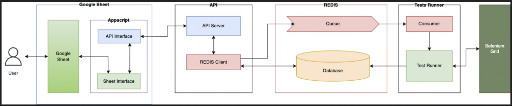
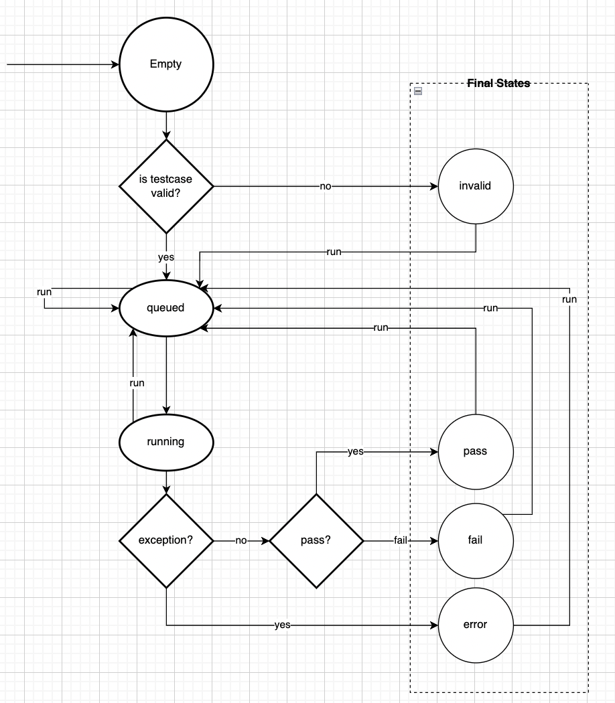
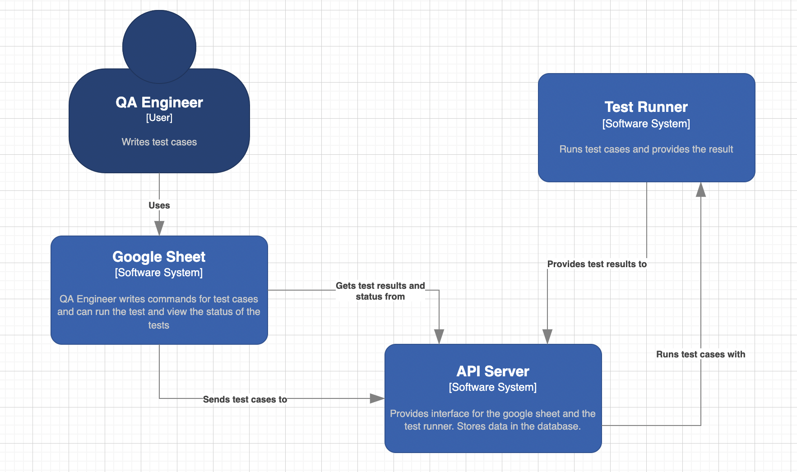
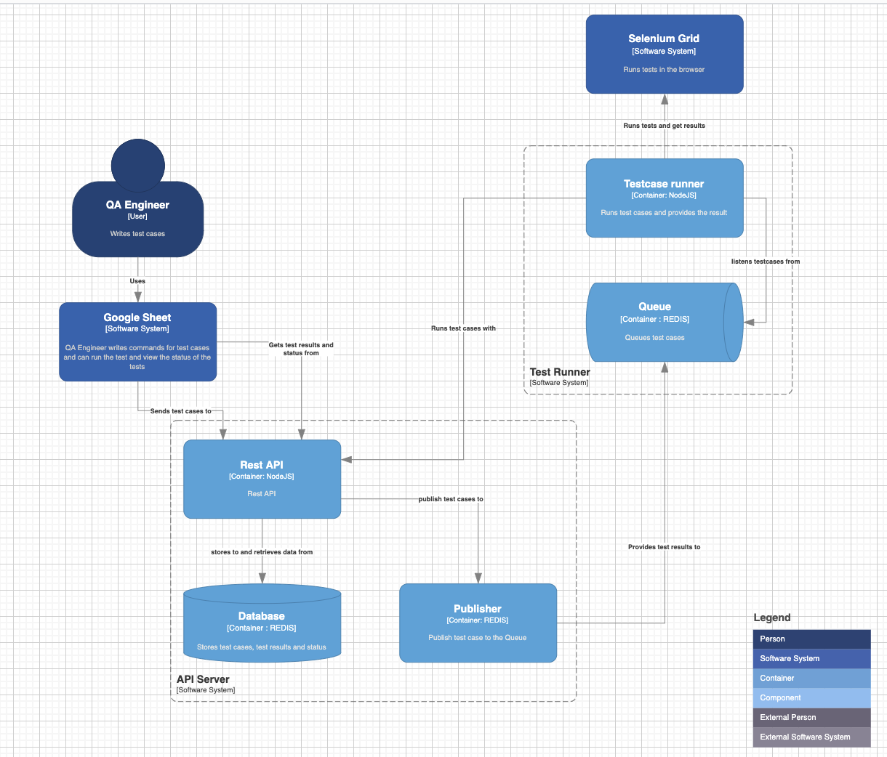

#

# System Introduction

The QA Automation Tool helps QA Engineers in testing the frontend of websites
easily without needing to setup browsers in their machines. With the help of
this system, QA Engineers can write the commands on Google sheets and run the
test cases on the server and get the test results on the Google sheet.

The system stores the user data temporarily in the REDIS volatile database.

#

# System Design

The system is comprised of different components as shown in the system-design diagram below:

The main components of the system are:

- Google Sheet: Writing test cases
- Appscript: Preparing test cases for the server and the interface between the google sheet and the server
- API - NodeJS: Receives test case data from the appscript via API calls and sends the data to the test runner via REDIS queue
- Queue - Redis: Queues the test cases to run in the test runner
- Database - Redis Volatile Database: Stores data, test results and states
- Test Runner: Listens to the queue and runs received test cases in the Selenium grid
- Selenium grid: Runs test cases

#

# System States

The test cases in the system can have following states:

- empty
- invalid
- queued
- running
- pass
- fail
- error

The flow of the states has been shown in the following state diagram.

#

# System Architecture

The system architecture has been shown in the following c1 to c2 diagrams.
The c3 and the c4 diagrams will be added later.

##

## C1

##

## C2

