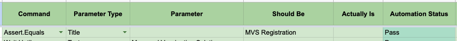

# Assert.Equals

Asserts properties of last selected element or page properties like URL and Title. You can extract attribute values, text content from previously selected element. For HTML **select** tag(dropdown), the currently selected value is asserted against provided values.

## Requirements

- **Command** column should have value **Assert.Equals**
- **Parameter Type** column should be **Title**, **URL**, **Text**, **Attribute**, **Dropdown**, **AssertContains**, **AssertStartsWith**, **AssertEndsWith**, **AssertGreaterThan**, or **AssertLessThan**.
- **Parameter** column should have a valid selected element's attribute string if **Parameter Type** is set to **Attribute**. For e.g. to assert the value of src for ``, parameter should be `src`.
- Assertions can be chained and would be evaluated against the last selected element.
- For **Parameter Type** **Title** and **URL**, no need to select an element.

## Excel Usage

