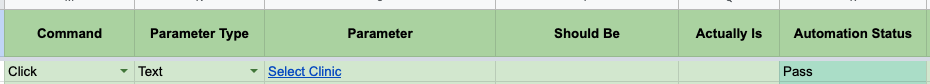

# Click

Click's **single element** that is currently in the webpage.

## Requirements

- **Command** column should have value **Click**
- **Parameter Type** column should be **XPath**, **CSS** or **Text**.
- **Parameter** column should have value corresponding to selected **Parameter Type**
- All other columns are ignored so it is recommended to leave it empty.

:::tip
You can select a particular `<option>` from a dropdown by providing it's xpath, css or text as a selector.
:::

## Excel Usage

