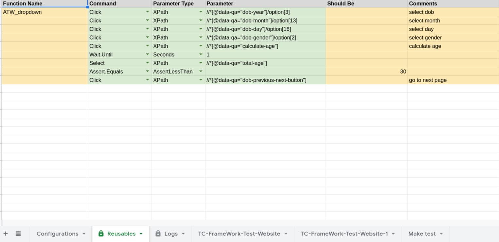

# Function

Function command is used to reuse multiple commands by calling function name in parameter column defined same as in **reusables** sheet. It is also used to separate commands by sections or parts of user interface.

## Requirements

- **Command** column should have value **Function**
- **Parameter** column should have function name.

## Excel Usage

## Reusables File

