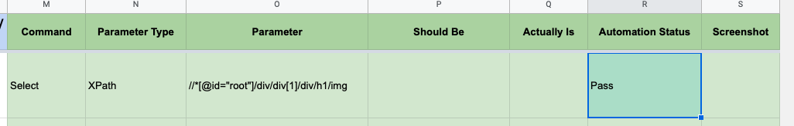

# Select

Select's a **single element** that is currently in the webpage.

## Requirements

- **Command** column should have value **Select**
- **Parameter Type** column should be **XPath**, **CSS** or **Text**.
- **Parameter** column should have value corresponding to selected **Parameter Type**
- All other columns are ignored so it is recommended to leave it empty.
- 🔥🔥🔥 Visit must be the first command in your excel file. You cant test something without visiting it. 🔥🔥🔥

## Excel Usage

