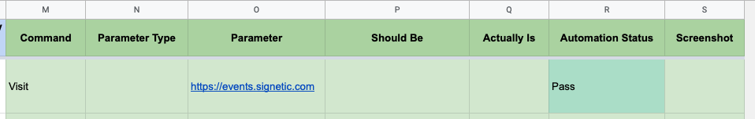

# Visit

**Visit** command opens a URL in browser.

## Requirements

- **Command** column should have value **Visit**
- **Parameter** column should be a valid URL.
- All other columns are ignored so it is recommended to leave it empty.
- 🔥🔥🔥 Visit must be the first command in your excel file. You can't test something without visiting it. 🔥🔥🔥

## Excel Usage

