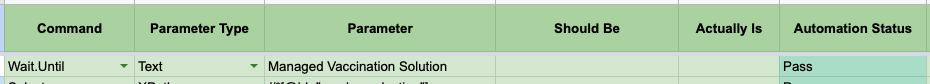

# Wait.Until

Wait's for certain conditions to be met before proceeding to subsequent tests.

## Requirements

- **Command** column should have value **Wait.Until**
- **Parameter Type** column should be **Title**, **URL**, **Text**, **XPath**, **CSS**, **MilliSeconds** or **Seconds**.
- **Title** waits until the current page title is same as provided.
- **URL** waits until the current page's url is same as provided.
- **Text** waits until the current page's content contains the particular text.
- **XPath** waits until the provided XPath is available in the page's html.
- **CSS** waits until the provided CSS selector is available in the page's html.
- **MilliSeconds** waits for the specified milliseconds.
- **Seconds** waits for the specified seconds.
- **Parameter** column should have appropriate value corresponding to **Parameter Type** column.

:::tip
Prefer XPath or CSS selector in place of Text selector. Text selector could fail if there are multiple texts with same content on the website.
:::

:::danger
Don't use MilliSeconds or Seconds when waiting for api calls to finish and page content to be changed. Api calls could fail and take variable amount of time.
:::

## Excel Usage

