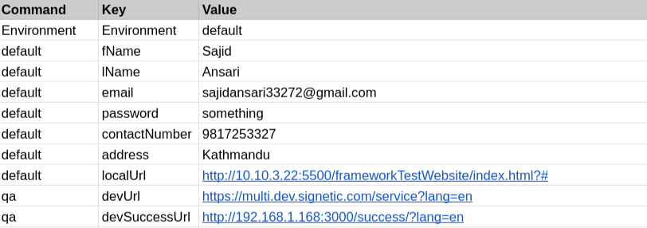

# Mustache Syntax {{mustache}}

We can use **{{key name}}** like syntax in excel file. The **key name** represent key which is replaced by it's corresponding value. The key name and it's value should be defined in configuration file. for eg: **{{firstName}}** ==> John doe

## Requirements

- **Command** column should have value defined in [commands reference](/docs/category/commands-reference/).
- **Parameter Type** column should have defined in [commands reference](/docs/category/commands-reference/).
- **Parameter** column should start with **{{** then **key name**, and close with **}}**.
- **key name** should be same as defined in configuration file.
- If key name doesn't found in configuration file, then remain as it is.

## Excel Usage

## Configuration File

