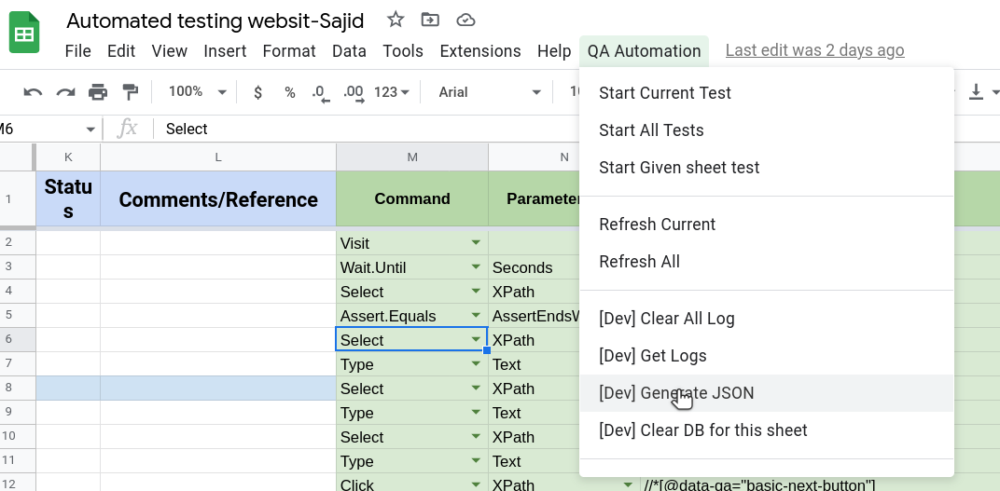

# Generate Json

This Command helps to convert or generate test cases into json and logs into **log** sheet.

# Steps

- Click on **QA Automation** from the top nav bar.
- Click **Generate JSON** from the option.

## Excel Usage

