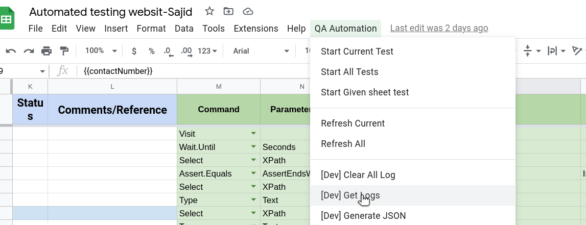

# Get logs

This Command helps to get all **logs** from db. We can see logs in **log** sheet.

# Steps

- Click on **QA Automation** from the top nav bar.
- Click **Get Logs** from the option.

## Excel Usage

