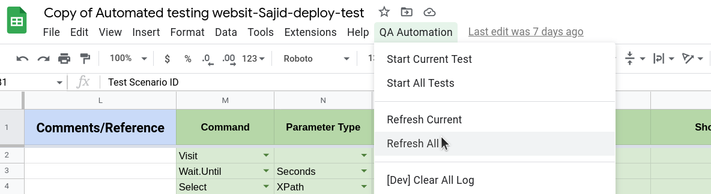

# Refresh All Tests

This Command helps to update test results of all test cases present in a spreadsheet. We can see the status in **automation status** column.

# Steps

- Click on **QA Automation** from the top nav bar.
- Click **Refresh All Tests** from the option.

## Excel Usage

