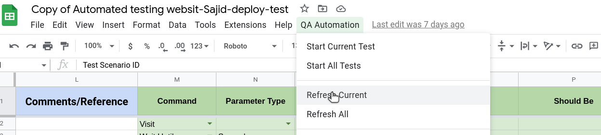

# Refresh Current

This Command helps to update test result of currently active spreadsheet. We can see the status in **automation status** column.

# Steps

- Click on **QA Automation** from the top nav bar.
- Click **Refresh Current** from the option.

## Excel Usage

