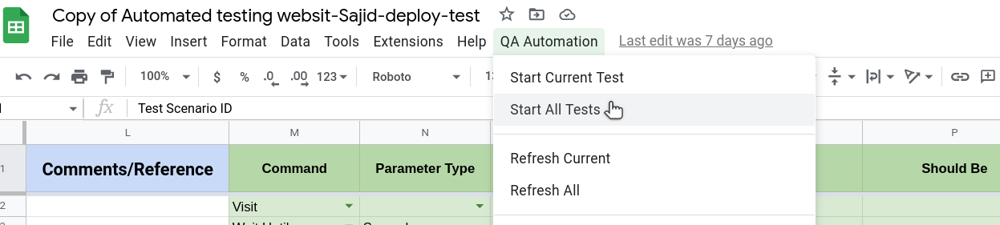
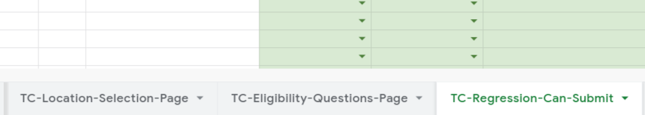

# Start All Tests

This Command helps to run all test cases presents in a spreadsheet. The sheets having name start with **TC**  are actual candidates to run test cases present within.

# Steps

- Click on **QA Automation** from the top nav bar.
- Click **Start All Tests** from the option.

## Excel Usage

