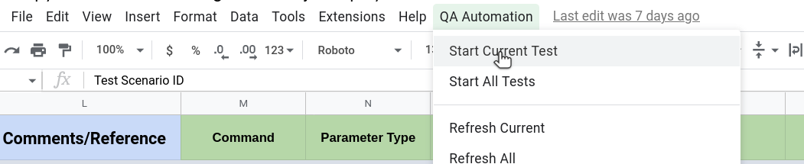

# Start Current Test

This Command helps to run all test cases of currently active spreadsheet.

# Steps

- Click on **QA Automation** from the top nav bar.
- Click **Start Current Test** from the option.

## Excel Usage

